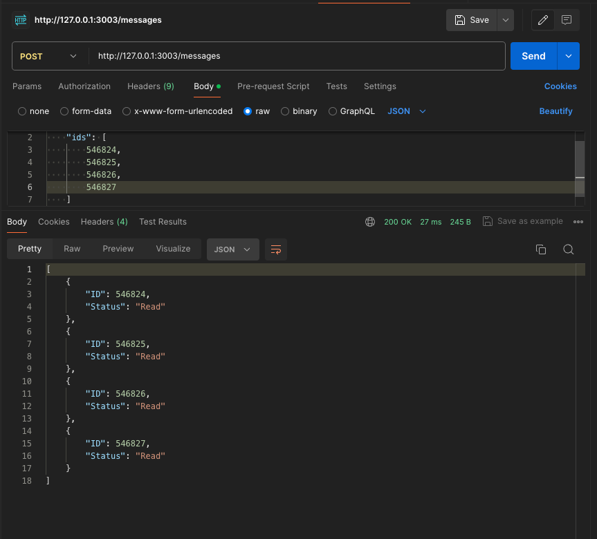

# Chatwoot Messages Status

This script is used to check the status of the messages in the Chatwoot platform. It will check the status of the messages in the Chatwoot platform and will send an email to the user if the message is not delivered from Chatwoot.

## Installation

1. Clone the repository
    ```git clone https://github.com/hasanbasri1993/ChatwootStatusMessages.git```
2. Change the directory ```cd ChatwootStatusMessages```
3. Open main.go, change the configuration based on your Chatwoot database

## Example Configuration

